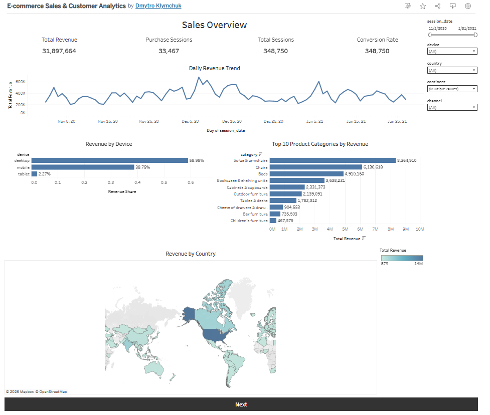
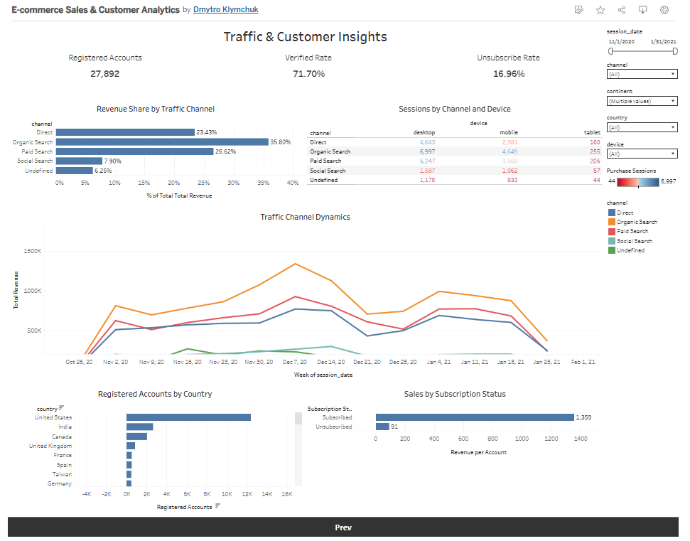

# 🛒 E-commerce Sales Analytics

An end-to-end data analytics project focused on exploring customer behavior,
sales performance, traffic sources, and product trends for an e-commerce business.

The project demonstrates a complete analytics workflow, including:

- SQL data extraction from Google BigQuery
- Data cleaning and preprocessing
- Exploratory Data Analysis (EDA)
- Statistical hypothesis testing
- Interactive Tableau dashboard

---

## 📊 Interactive Dashboard

🔗 Tableau Public:
https://public.tableau.com/app/profile/dmytro.klymchuk/viz/E-commerceSalesCustomerAnalytics_17851452678650/SalesOverview#1

---

## 🚀 Project Objectives

The main goal of this project is to analyze e-commerce sales and identify
business insights related to:

- Customer purchasing behavior
- Product categories
- Geographic distribution
- Traffic acquisition channels
- Device usage
- Registered vs Guest customers

---

## 🛠 Tech Stack

- SQL (Google BigQuery)
- Python
- pandas
- NumPy
- SciPy
- Statsmodels
- Matplotlib
- Plotly
- Tableau Public
- Jupyter Notebook

---

## 📂 Repository Structure

```
├── notebook/
│   └── ecommerce_sales_analysis.ipynb
│
├── sql/
│   └── queries.sql
│
├── data/
│
├── images/
│
├── requirements.txt
│
└── README.md
```

---

## 📈 Analysis Performed

### Data Cleaning

- Missing values
- Duplicate detection
- Data validation
- Feature engineering

### Exploratory Data Analysis

- Sales dynamics
- Product categories
- Customer geography
- Devices
- Traffic channels

### Statistical Analysis

- Correlation analysis
- Mann–Whitney U Test
- Wilcoxon Signed-Rank Test
- Friedman Test
- Kruskal–Wallis Test

### Visualization

- Python charts
- Tableau interactive dashboard

---

## 🔍 Key Insights

- Daily revenue differs significantly between registered and guest users.
- Organic Search generates the highest daily traffic.
- Purchase prices do not significantly differ between desktop and mobile users.
- Purchase prices are statistically similar across the three leading continents.
- Sales dynamics are positively correlated across major geographic regions.

---

## 📷 Dashboard Preview




---

## 👤 Author

**Dmytro Klymchuk**
